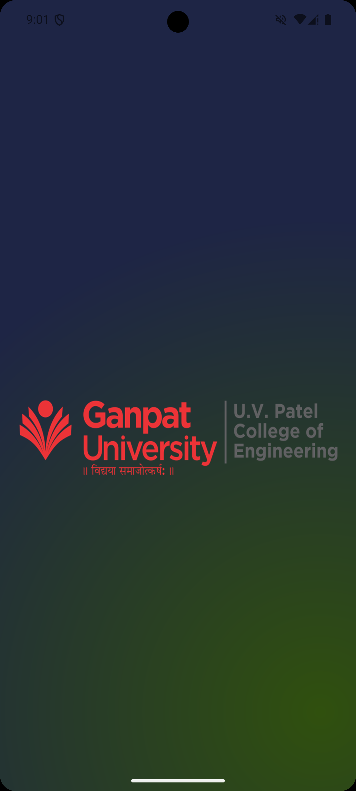
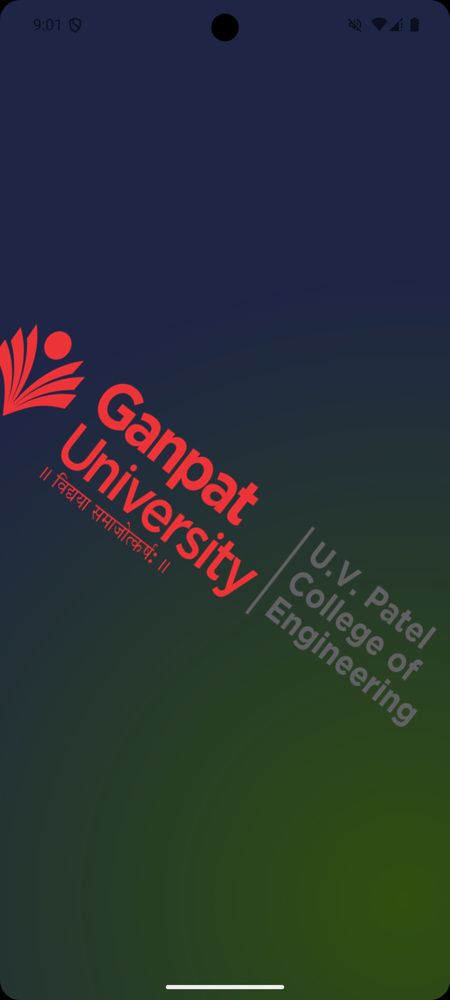
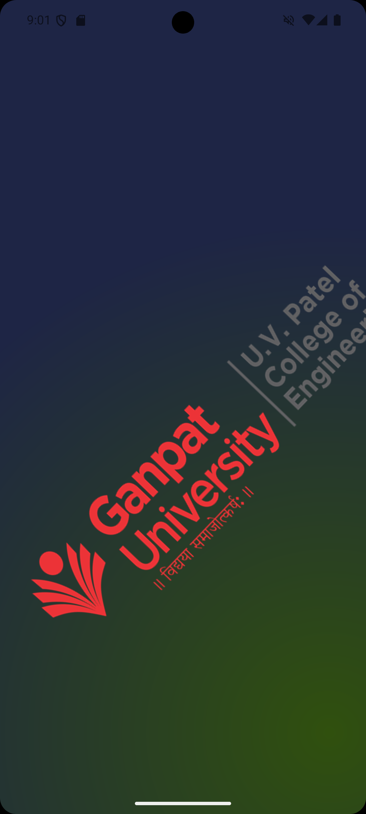
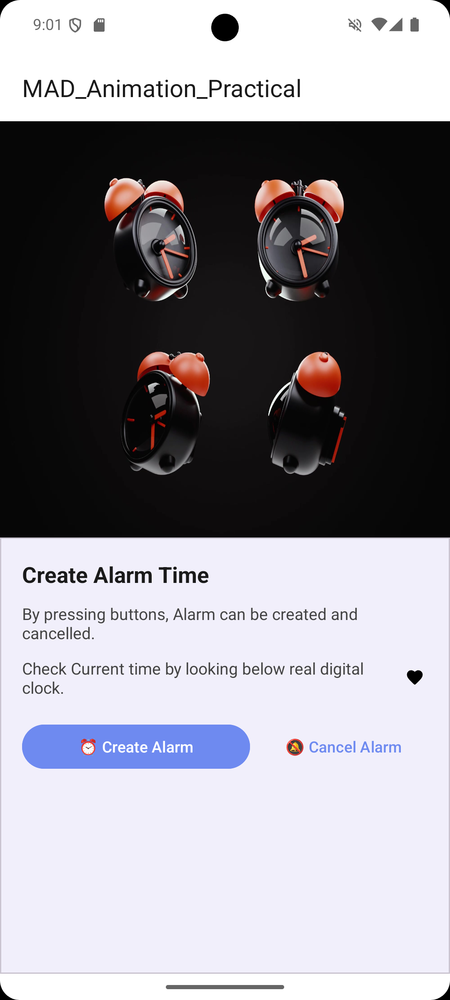
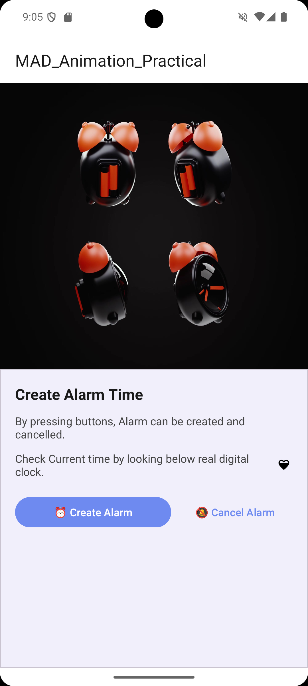

# Practical 6: Frame by Frame Animation & Twin Animation

## Aim

Create Android Application to demonstrate Frame by frame animation and splash screen to demonstrate twin animation.

---

## Application Demo

<table width="100%">
<tr>
<td width="50%" valign="top">

### 🎥 Demo

[▶️ Watch Practical 6 Demo](demo/prac6demo.webm)

</td>

<td width="50%" valign="top">

### 📝 Animations Demonstrated

1. **Frame by Frame Animation**
2. **Splash Screen**
3. **Twin Animation**
4. **Alarm Clock Animation**
5. **Heart Animation**

</td>
</tr>
</table>

---

## Application Logic

### 1. Frame by Frame Animation

Frame by Frame Animation displays a sequence of drawable images one after another to create the effect of motion.

In this practical, `AnimationDrawable` is used to implement frame by frame animation for the logo, alarm clock, and heart image.

---

### 2. Splash Screen Frame Animation

The Splash Screen uses an `ImageView` with the `uvpce_animation_list` drawable resource.

```kotlin
imgLogo = findViewById(R.id.imgLogo)

imgLogo.setBackgroundResource(R.drawable.uvpce_animation_list)

guniframeanimation = imgLogo.background as AnimationDrawable
```

The `uvpce_animation_list.xml` contains 8 logo frames:

```xml
<animation-list
    xmlns:android="http://schemas.android.com/apk/res/android"
    android:oneshot="true">

    <item
        android:drawable="@drawable/uvpce_logo_1"
        android:duration="100"/>

    <item
        android:drawable="@drawable/uvpce_logo_2"
        android:duration="100"/>

    <item
        android:drawable="@drawable/uvpce_logo_3"
        android:duration="200"/>

    <item
        android:drawable="@drawable/uvpce_logo_4"
        android:duration="100"/>

    <item
        android:drawable="@drawable/uvpce_logo_5"
        android:duration="200"/>

    <item
        android:drawable="@drawable/uvpce_logo_6"
        android:duration="100"/>

    <item
        android:drawable="@drawable/uvpce_logo_7"
        android:duration="100"/>

    <item
        android:drawable="@drawable/uvpce_logo"
        android:duration="100"/>

</animation-list>
```

The `android:oneshot="true"` attribute makes the frame animation play only once.

* **AnimationDrawable**: Displays the drawable frames sequentially.
* **animation-list**: Defines the sequence of animation frames.
* **duration**: Defines how long each frame is displayed.
* **oneshot="true"**: Makes the animation run only once.

---

### 3. Starting Frame Animation

The Frame by Frame Animation is started inside `onWindowFocusChanged()`.

```kotlin
override fun onWindowFocusChanged(hasFocus: Boolean) {
    super.onWindowFocusChanged(hasFocus)

    if (hasFocus) {
        guniframeanimation.start()
        imgLogo.startAnimation(gunianimation)
    } else {
        guniframeanimation.stop()
    }
}
```

When the Splash Activity gains window focus, both the Frame by Frame Animation and Twin Animation are started.

When the Activity loses focus, the Frame by Frame Animation is stopped.

* **onWindowFocusChanged()**: Detects whether the Activity has gained or lost window focus.
* **start()**: Starts the `AnimationDrawable`.
* **stop()**: Stops the `AnimationDrawable`.

---

### 4. Twin Animation

Twin Animation is implemented using the Android `Animation` framework and `AnimationUtils`.

The animation is defined inside:

```text
res/anim/twinanimation.xml
```

The `<set>` tag is used to combine multiple animations together.

```xml
<set xmlns:android="http://schemas.android.com/apk/res/android"
    android:startOffset="1000">

    <translate
        android:fromXDelta="1.0"
        android:fromYDelta="1.0"
        android:toXDelta="10.0"
        android:toYDelta="100.0"
        android:duration="750"/>

    <rotate
        android:fromDegrees="0"
        android:toDegrees="360"
        android:pivotX="50%"
        android:pivotY="50%"
        android:duration="1500"/>

    <scale
        android:fromXScale="1.0"
        android:fromYScale="1.0"
        android:toXScale="2.0"
        android:toYScale="2.0"
        android:pivotX="50%"
        android:pivotY="50%"
        android:duration="750"/>

    <scale
        android:fromXScale="1.0"
        android:fromYScale="1.0"
        android:toXScale="0.5"
        android:toYScale="0.5"
        android:pivotX="50%"
        android:pivotY="50%"
        android:duration="750"
        android:startOffset="750"/>

</set>
```

The Twin Animation contains the following transformations:

* **Translate**: Moves the logo from one position to another.
* **Rotate**: Rotates the logo from `0°` to `360°`.
* **Scale Up**: Increases the logo from `1.0x` to `2.0x`.
* **Scale Down**: Reduces the logo from `1.0x` to `0.5x`.
* **Start Offset**: The complete animation starts after `1000 ms`.

---

### 5. Loading Twin Animation

The Twin Animation is loaded using `AnimationUtils`.

```kotlin
gunianimation = AnimationUtils.loadAnimation(
    this,
    R.anim.twinanimation
)
```

The animation is then applied to the logo:

```kotlin
imgLogo.startAnimation(gunianimation)
```

* **AnimationUtils**: Loads the animation resource from `res/anim`.
* **startAnimation()**: Applies the animation to the `ImageView`.

---

### 6. Animation Listener

`SplashActivity` implements `Animation.AnimationListener` to detect the different stages of the Twin Animation.

```kotlin
class SplashActivity : AppCompatActivity(), Animation.AnimationListener
```

The listener is attached to the animation:

```kotlin
gunianimation.setAnimationListener(this)
```

The callback methods are:

```kotlin
override fun onAnimationStart(animation: Animation?) {
}

override fun onAnimationEnd(animation: Animation?) {
    Intent(this, MainActivity::class.java).also {
        startActivity(it)
    }
}

override fun onAnimationRepeat(animation: Animation?) {
}
```

The `onAnimationEnd()` method navigates from `SplashActivity` to `MainActivity` using an explicit `Intent`.

```kotlin
Intent(this, MainActivity::class.java).also {
    startActivity(it)
}
```

* **onAnimationStart()**: Called when the animation starts.
* **onAnimationEnd()**: Called when the animation finishes and opens `MainActivity`.
* **onAnimationRepeat()**: Called when the animation repeats.

---

### 7. Alarm Clock Animation

The Main Activity contains a frame by frame animated alarm clock.

```kotlin
val alarmImage = findViewById<ImageView>(R.id.ivAlarm)

alarmImage.setBackgroundResource(R.drawable.alarm_frame_anim)

val alarmAnimation =
    alarmImage.background as AnimationDrawable

alarmAnimation.start()
```

The `alarm_frame_anim` drawable resource is assigned as the background of the alarm `ImageView`.

It is then converted into an `AnimationDrawable` and started.

* **ivAlarm**: ImageView containing the alarm animation.
* **alarm_frame_anim**: Drawable resource containing the animation frames.
* **start()**: Starts the alarm animation.

---

### 8. Heart Animation

A frame by frame animation is also applied to the heart image.

```kotlin
val heart = findViewById<ImageView>(R.id.ivHeart)

heart.setBackgroundResource(R.drawable.ic_heart_outline)

val heartAnimation =
    heart.background as AnimationDrawable

heartAnimation.start()
```

The `ic_heart_outline` drawable resource is assigned to the heart `ImageView`.

It is then converted into an `AnimationDrawable` and started.

* **ivHeart**: ImageView containing the heart animation.
* **ic_heart_outline**: Drawable animation resource.
* **AnimationDrawable**: Controls the heart animation frames.

---

## UI Details

### Splash Activity (`activity_splash.xml`)

The Splash Screen contains the logo that is used for both Frame by Frame Animation and Twin Animation.

The logo is accessed using:

```kotlin
imgLogo = findViewById(R.id.imgLogo)
```

The Frame by Frame Animation is assigned to the logo:

```kotlin
imgLogo.setBackgroundResource(
    R.drawable.uvpce_animation_list
)
```

The Twin Animation is applied to the same `ImageView`:

```kotlin
imgLogo.startAnimation(gunianimation)
```

Therefore, the Splash Screen demonstrates both **Frame by Frame Animation** and **Twin Animation**.

---

### Main Activity (`activity_main.xml`)

The Main Activity contains two animated `ImageView` elements.

#### Alarm Image

The alarm animation uses:

```kotlin
findViewById<ImageView>(R.id.ivAlarm)
```

and the drawable resource:

```kotlin
R.drawable.alarm_frame_anim
```

#### Heart Image

The heart animation uses:

```kotlin
findViewById<ImageView>(R.id.ivHeart)
```

and the drawable resource:

```kotlin
R.drawable.ic_heart_outline
```

Both animations are implemented using `AnimationDrawable`.

---

## Edge-to-Edge Display

Both `MainActivity` and `SplashActivity` use:

```kotlin
enableEdgeToEdge()
```

to enable edge-to-edge display.

`WindowInsetsCompat` is used to obtain the system bar insets:

```kotlin
val systemBars =
    insets.getInsets(WindowInsetsCompat.Type.systemBars())
```

The system bar values are then applied as padding:

```kotlin
v.setPadding(
    systemBars.left,
    systemBars.top,
    systemBars.right,
    systemBars.bottom
)
```

This ensures that the application content is displayed correctly around the system bars.

---

## Screenshots

### Splash Screen

<table width="100%">
<tr>
<td width="33%">

</td>

<td width="33%">

</td>

<td width="33%">

</td>
</tr>

<tr>
<td align="center"><b>Animation Start</b></td>
<td align="center"><b>Rotate + Scale Up</b></td>
<td align="center"><b>Animation End</b></td>
</tr>
</table>

---

### Main Screen

<table width="100%">
<tr>
<td width="50%">

</td>

<td width="50%">

</td>
</tr>

<tr>
<td align="center"><b>Alarm Animation Frame 1</b></td>
<td align="center"><b>Alarm Animation Frame 2</b></td>
</tr>
</table>

---

## Concepts & Components Used

* `ImageView`
* `AnimationDrawable`
* `Animation`
* `AnimationUtils`
* `Animation.AnimationListener`
* `onWindowFocusChanged()`
* `<animation-list>`
* `android:oneshot`
* `<set>`
* `<translate>`
* `<rotate>`
* `<scale>`
* `enableEdgeToEdge()`
* `WindowInsetsCompat`
* `Intent`

---

## Student Details

* **Enrollment No:** 24012011140
* **Practical:** 06
* **Subject:** Mobile Application Development (MAD)

---

## Conclusion

The Practical 6 application successfully demonstrates **Frame by Frame Animation** and **Twin Animation** in Android.

Frame by Frame Animation is implemented using `AnimationDrawable` for the Ganpat University logo, alarm clock, and heart image. The Splash Screen uses an 8-frame animation list with `android:oneshot="true"` to display the logo frames sequentially.

Twin Animation is implemented using a `<set>` containing **translate, rotate, and scale** animations. The animation is loaded using `AnimationUtils` and applied to the logo using `startAnimation()`.

The `Animation.AnimationListener` is used to detect the completion of the Twin Animation. Once the animation ends, an `Intent` is used to navigate from `SplashActivity` to `MainActivity`.

The practical also demonstrates `onWindowFocusChanged()`, `enableEdgeToEdge()`, and `WindowInsetsCompat` for handling animation execution and system bar insets.

Through this practical, the implementation and working of **Frame by Frame Animation and Twin Animation** in Android were successfully understood and demonstrated.